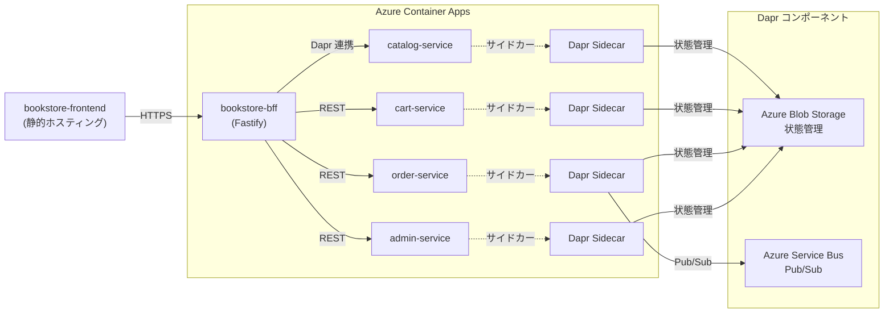

# 書籍ストア（ほんのわ書店）

オンライン書籍販売サイトのフルスタックWebアプリケーションです。モノリシック構成とマイクロサービス構成の両方をサポートしており、Azure Container Appsへのデプロイが可能です。

## アプリケーション概要

「ほんのわ書店」は、書籍の閲覧、カート管理、注文処理、および管理機能を備えた完全なEコマースアプリケーションです。

### 主な機能

- **書籍カタログ**: 書籍の一覧表示、詳細表示、ジャンル別フィルタリング
- **ショッピングカート**: カートへの追加、削除、数量変更
- **注文処理**: チェックアウト、注文確認、注文履歴
- **管理機能**: 書籍の追加、編集、削除（管理者用）
- **レスポンシブデザイン**: モバイル、タブレット、デスクトップに対応

### 技術スタック

#### フロントエンド
- React + TypeScript
- Vite（ビルドツール）
- Tailwind CSS（スタイリング）
- shadcn/ui（UIコンポーネント）

#### バックエンド
- Node.js + TypeScript
- Fastify（Webフレームワーク）
- Dapr（分散アプリケーションランタイム）

#### インフラストラクチャ
- Azure Container Apps
- Azure Blob Storage（状態管理）
- Azure Service Bus（メッセージング）
- Azure Log Analytics（監視）

## プロジェクト構成

このリポジトリには2つの実装パターンが含まれています：

### モノリシック構成（`monolith/`）

シンプルな単一アプリケーション構成。開発とデプロイが容易で、小規模プロジェクトに適しています。

- フロントエンド＋バックエンドが一体化
- ローカル開発に最適

### マイクロサービス構成（`microservice/`）

スケーラブルな分散アーキテクチャ。各機能が独立したサービスとして実装されています。

- **catalog-service**: 書籍カタログAPI（ポート: 4101）
- **cart-service**: ショッピングカート管理（ポート: 4102）
- **order-service**: 注文処理（ポート: 4103）
- **admin-service**: 管理機能（ポート: 4104）
- **bookstore-bff**: Backend for Frontend（ポート: 4000）
- **bookstore-frontend**: フロントエンド（Nginx）

## デプロイ手順

### マイクロサービス構成でのデプロイ

Azure Container Appsへのマイクロサービスデプロイの詳細な手順については、以下のドキュメントを参照してください：

📖 **[Microservice Services ガイド](./microservice/services/README.md)**

このガイドには以下の内容が含まれます：
- 前提条件とAzure CLIのセットアップ
- Azure Container Apps環境の構築
- Daprコンポーネントの設定
- マネージドIDとRBACの構成
- 各マイクロサービスのデプロイ手順
- 動作確認とログ監視方法

### ローカル開発

各ディレクトリ（`monolith/` または `microservice/`）内のREADMEを参照してください。

## アーキテクチャ

### マイクロサービスアーキテクチャ

## スクリーンショット

### フロントエンド画面

### Azure Container Appsデプロイ結果

## ライセンス

このプロジェクトはMITライセンスの下でライセンスされています。
