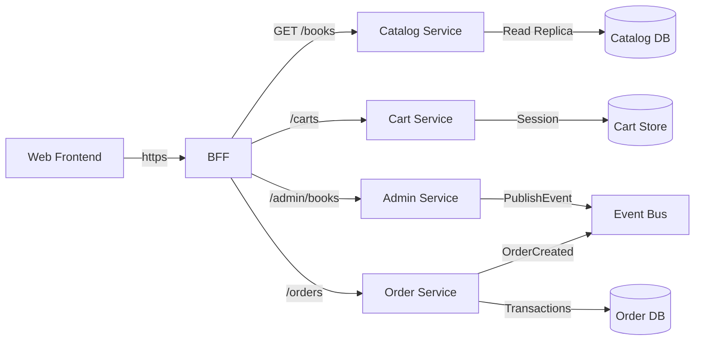
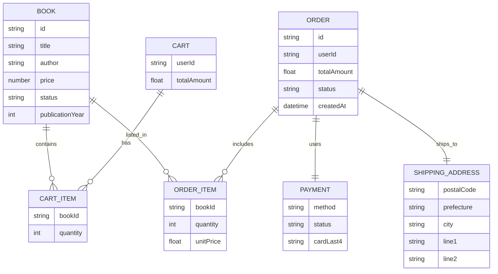

## 目的

Catalog / Cart / Order / Admin サービスの初期 API コントラクトとデータ境界を
可視化し、BFF や他サービスとの契約を明文化する。

## 提供物

- OpenAPI 3.1 スキーマ: `microservice/contracts/*.openapi.yaml`
- コンテキスト図 (サービス間連携)
- エンティティ関係図 (主要データモデル)

## コンテキスト図

## エンティティ関係図

## オープン課題

- 決済トークン仕様とキャプチャタイミングは外部 PSP と要調整
- 管理 API の認可モデル (RBAC / ABAC) は別途セキュリティチームと合意が必要
- カタログタグのマスタ管理方式 (静的テーブル vs 管理 API) を検討中
