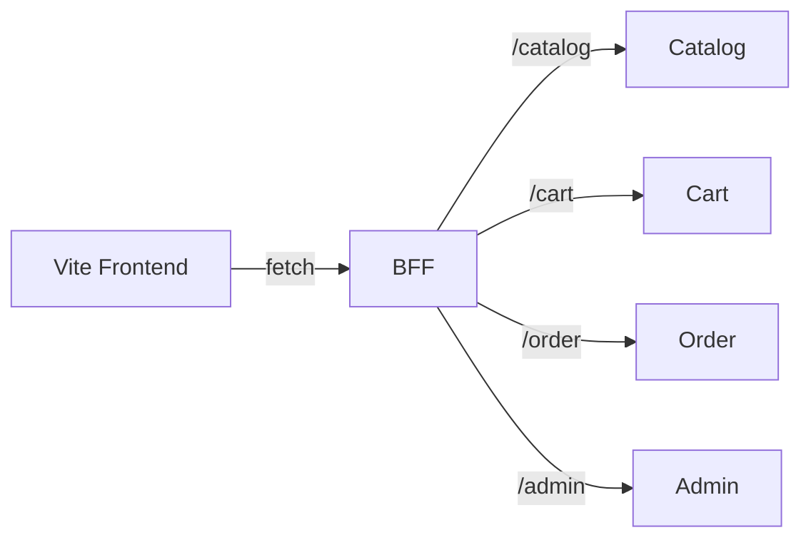

## BFF テンプレート概要

- 実装場所: `microservice/bff`
- ランタイム: Node.js + Fastify 4 系
- 主な機能:
  - `/catalog`, `/cart`, `/order`, `/admin` を各サービスにプロキシ
  - `.env` ベースで upstream URL を設定
  - `/healthz` にヘルスチェックを提供
- 初期コマンド: `npm install && npm run dev`

## フロントエンド依存マップ

| 機能 | コンポーネント | 現行データソース | 将来の BFF 経由 API |
| --- | --- | --- | --- |
| カタログ表示 | `CatalogPage`, `BookCard`, `BookDetailPage` | `booksData` (静的) | `GET /catalog/books`, `GET /catalog/books/:id` |
| カート | `CartPage`, `usePersistentState` | `localStorage` (`shopping-cart`) | `GET/PUT /cart/{userId}`, `POST /cart/{userId}/items` |
| 注文チェックアウト | `CheckoutPage`, `OrderCompletedPage` | カートのローカルデータ | `POST /order/orders`, `GET /order/orders/{id}` |
| 管理機能 | `AdminPage`, `BookForm`, `BookListAdmin` | `booksData` に対するローカル操作 | `POST/PUT /admin/books`, `POST /admin/books/{id}/publish` |

### 観測状況

- 現状、外部 API 呼び出しは存在せず、`booksData`・`usePersistentState` を通じて
  静的データと `localStorage` を利用している。
- BFF 導入により、これらのアクセス層を `fetch('/catalog/...')` などに統一する
  リファクタリングが必要。
- カートと注文はユーザー識別子が存在しないため、BFF 実装時に認証連携と ID 管理
  を決定する必要がある。
- Dapr 有効時は `http://localhost:3500/v1.0/invoke/<app-id>/method/...` にプロキシ先を
  切り替えることでサービス検出を自動化できる。

## 今後のアクション

1. フロントエンドのデータ取得ロジックをサービス別のクライアントに置き換える。
2. 認証方式 (セッショントークン / JWT) を決定し、BFF での検証方法を設計する。
3. BFF から下流サービスへのタイムアウト・リトライ・エラーハンドリング方針を具体化。

## 完了判定メモ

- BFF 雛形と環境変数テンプレート (.env) を整備
- 依存関係マップを作成しドキュメント化
- 次フェーズのリファクタリング項目を列挙
