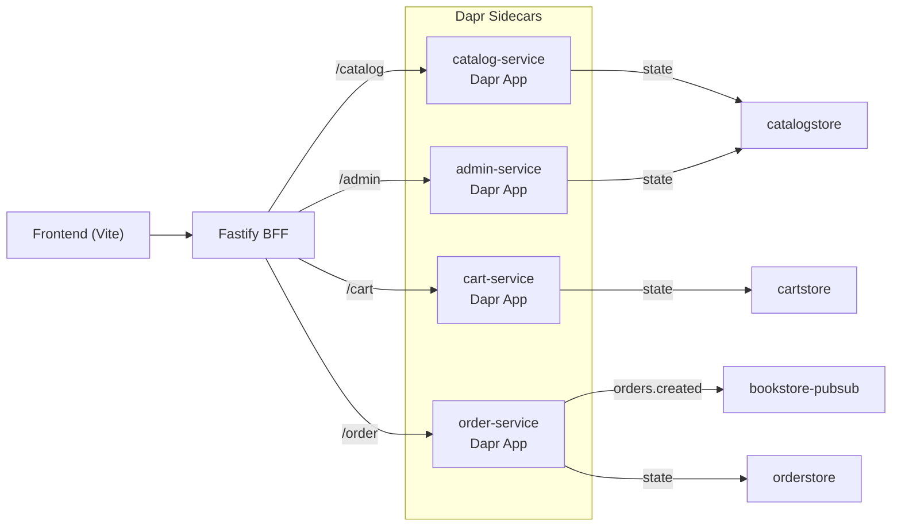

## アーキテクチャ全体像

- Dapr をサイドカーとして有効化し、サービス間通信・ステート管理・イベント配信を統一。
- Azure Container Apps への展開を想定し、`catalog`, `cart`, `order`, `admin` の 4 サービスを分割。
- BFF は API Gateway 的に HTTP プロキシを担い、Dapr 経由／直接アクセスを環境変数で切り替え可能。

## Dapr コンポーネント

| コンポーネント | 種類 | スコープ | 用途 |
| --- | --- | --- | --- |
| `catalogstore` | state.in-memory | catalog-service, admin-service | 書籍メタデータの共有ストア |
| `cartstore` | state.in-memory | cart-service | ユーザーカート状態の保存 |
| `orderstore` | state.in-memory | order-service | 注文履歴の保存 |
| `bookstore-pubsub` | pubsub.in-memory | order-service | 注文イベント配信 |

> **参照資料**
> - [Dapr を利用したマイクロサービス API](https://learn.microsoft.com/ja-jp/azure/container-apps/dapr-overview)
> - [クイックスタート: Dapr アプリを Azure Container Apps にデプロイ](https://learn.microsoft.com/ja-jp/azure/container-apps/microservices-dapr?tabs=bash)

## サービスごとの責務

### Catalog Service

- ステートストアに初期データをシードし、検索フィルターと詳細取得を提供。
- `publicationStatus` を含むメタデータを返し、Admin Service と同じストアを共有。

### Cart Service

- Dapr ステートストアを通じてユーザーごとのカートを保存。
- 書籍価格は `catalog-service` を Dapr 経由で呼び出して算定。

### Order Service

- 注文の合計金額計算と保存、ステータス更新でイベントを `bookstore-pubsub` に発行。
- 決済情報はトークンからマスク済みカード情報を生成して格納。

### Admin Service

- 書籍の登録・更新・削除・公開切り替えを担い、同じステートストアを更新。
- BFF 経由の保護を前提にしつつ、RBAC 導入は後続タスク。

## デプロイ想定

1. Azure Container Apps 環境を作成し、必要なプロバイダーを登録。
2. `dapr/components` ディレクトリを `az containerapp env dapr-component set` でデプロイ。
3. 各サービスを `dapr run` もしくは CI/CD で `--enable-dapr` を付与してデプロイ。
4. BFF の `CATALOG_SERVICE_URL` などを Dapr 経由 (`http://localhost:3500/v1.0/invoke/...`) に設定。

## 運用メモ

- 開発時は `USE_IN_MEMORY_DAPR=true` を設定すると Dapr なしでテストが実行可能。
- 本番では Azure Blob Storage や Azure Service Bus などのマネージドコンポーネントへ差し替え。
- `order-service` の pub/sub は今後の在庫更新や通知サービスへ拡張可能。
