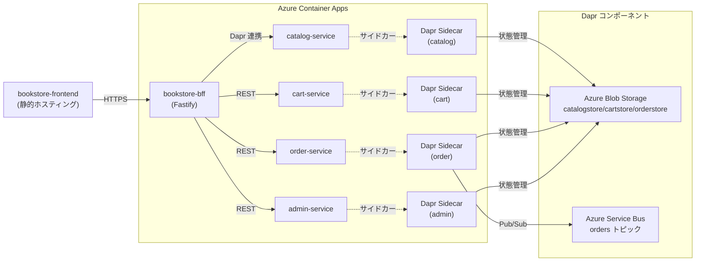
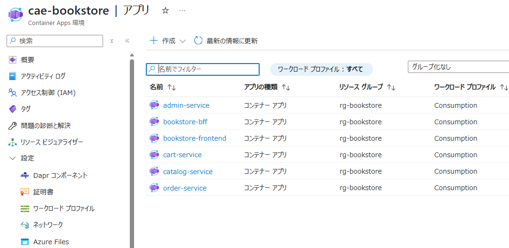
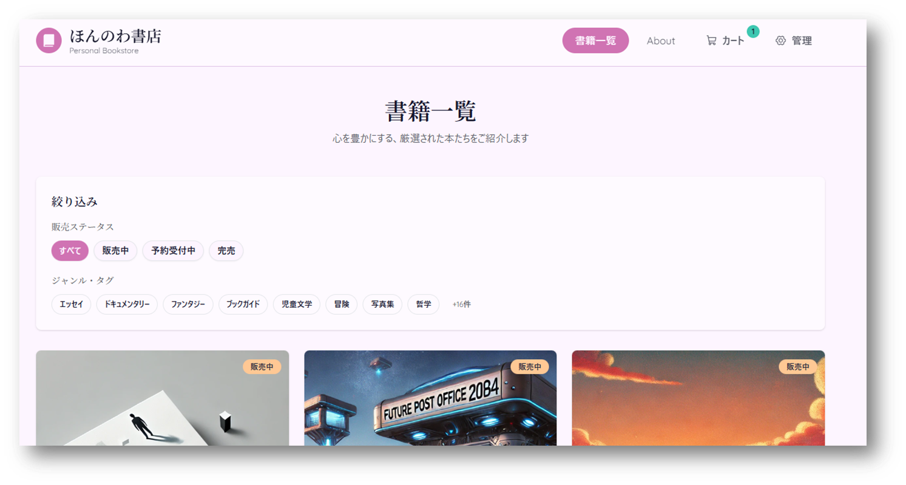

## Microservice Suite

`microservice/services` ディレクトリには、カタログ、カート、注文、管理の各機能を分割した Fastify ベースのサービス群が含まれます。Dapr を利用してサービス間通信とステート管理を統一しています。

## サービス一覧

| サービス | ポート | Dapr App ID | 主な役割 |
| --- | --- | --- | --- |
| catalog-service | 4101 | `catalog-service` | 書籍カタログ API |
| cart-service | 4102 | `cart-service` | ショッピングカート管理 |
| order-service | 4103 | `order-service` | 注文作成・ステータス管理 |
| admin-service | 4104 | `admin-service` | 管理用の書籍 CRUD |

### アーキテクチャ図



## 起動手順

1. 各ディレクトリで依存関係をインストールします。
2. Dapr を利用する場合は `microservice/dapr/components` を指定して `dapr run` を実行します。
> **Memo:** GitHub Container Registry (ghcr.io) を利用する場合は `docker login ghcr.io -u <GitHubユーザー名>` を実行し、`write:packages/read:packages` 権限を持つ PAT を用意してください。

3. BFF (`microservice/bff`) からは `http://localhost:410x` または Dapr 経由 (`http://localhost:3500/v1.0/invoke/...`) で呼び出せます。

例: カタログとカートを同時に起動する（ローカルで実施する場合）

```bash
(cd catalog && npm install && dapr run --app-id catalog-service --app-port 4101 --components-path ../../dapr/components -- npm run dev)
(cd cart && npm install && dapr run --app-id cart-service --app-port 4102 --components-path ../../dapr/components -- npm run dev)
```

## Azure Container Apps デプロイ手順

### 前提条件

- Azure CLI 2.59 以降（`az version` で確認）
- Docker とコンテナレジストリ（Azure Container Registry を推奨）
- リポジトリの Dockerfile／Dapr コンポーネント定義をチェックアウト済み

```bash
az login
az upgrade
az extension add --name containerapp --upgrade --allow-preview true
az provider register --namespace Microsoft.App
az provider register --namespace Microsoft.OperationalInsights
```

### 環境変数の定義

以降の手順で共通的に利用する値をエクスポートします。必要に応じて命名規則やロケーションを変更してください。

```bash
export RESOURCE_GROUP="rg-bookstore"
export LOCATION="japaneast"
export CONTAINERAPPS_ENVIRONMENT="cae-bookstore"
export LOG_ANALYTICS_WORKSPACE="law-bookstore"
export STORAGE_ACCOUNT_NAME="bookstorestate$(date +%s)"
export SERVICE_BUS_NAMESPACE="bookstore-bus-$(date +%s)"
export MANAGED_IDENTITY_NAME="bookstore-managed-id"
```

### Azure リソースの作成

```bash
az group create \
	--name "$RESOURCE_GROUP" \
	--location "$LOCATION"

az monitor log-analytics workspace create \
	--resource-group "$RESOURCE_GROUP" \
	--workspace-name "$LOG_ANALYTICS_WORKSPACE" \
	--location "$LOCATION"

# LogAnalytics ID
LOG_ANALYTICS_ID=$(az monitor log-analytics workspace show \
	--resource-group "$RESOURCE_GROUP" \
	--workspace-name "$LOG_ANALYTICS_WORKSPACE" \
	--query id --output tsv | xargs)

# LogAnalytics KEY
LOG_ANALYTICS_KEY=$(az monitor log-analytics workspace get-shared-keys \
	--resource-group "$RESOURCE_GROUP" \
	--workspace-name "$LOG_ANALYTICS_WORKSPACE" \
	--query primarySharedKey --output tsv | xargs)

# 変数の値を確認
echo "LOG_ANALYTICS_ID: $LOG_ANALYTICS_ID"
echo "LOG_ANALYTICS_KEY length: ${#LOG_ANALYTICS_KEY}"

# customerId（ワークスペース ID）を抽出
LOG_ANALYTICS_CUSTOMER_ID=$(az monitor log-analytics workspace show \
	--resource-group "$RESOURCE_GROUP" \
	--workspace-name "$LOG_ANALYTICS_WORKSPACE" \
	--query customerId --output tsv | xargs)

echo "LOG_ANALYTICS_CUSTOMER_ID: $LOG_ANALYTICS_CUSTOMER_ID"

az containerapp env create \
	--name "$CONTAINERAPPS_ENVIRONMENT" \
	--resource-group "$RESOURCE_GROUP" \
	--location "$LOCATION" \
	--logs-workspace-id "$LOG_ANALYTICS_CUSTOMER_ID" \
	--logs-workspace-key "$LOG_ANALYTICS_KEY"
```

### ステートストアとメッセージングの準備

```bash
az storage account create \
	--name "$STORAGE_ACCOUNT_NAME" \
	--resource-group "$RESOURCE_GROUP" \
	--location "$LOCATION" \
	--sku Standard_RAGRS \
	--kind StorageV2 \
	--allow-shared-key-access false

# ストレージキーの取得（後で使用）
STORAGE_KEY=$(az storage account keys list \
	--resource-group "$RESOURCE_GROUP" \
	--account-name "$STORAGE_ACCOUNT_NAME" \
	--query "[0].value" --output tsv)

# コンテナーの作成（Azure AD 認証を使用）
for container in catalogstore cartstore orderstore; do
	az storage container create \
		--name "$container" \
		--account-name "$STORAGE_ACCOUNT_NAME" \
		--auth-mode login
done

az servicebus namespace create \
	--name "$SERVICE_BUS_NAMESPACE" \
	--resource-group "$RESOURCE_GROUP" \
	--location "$LOCATION"

# トピック作成時、既に存在する場合はエラーが出ても続行
az servicebus topic create \
	--resource-group "$RESOURCE_GROUP" \
	--namespace-name "$SERVICE_BUS_NAMESPACE" \
	--name orders 2>/dev/null || echo "Topic 'orders' already exists or namespace creation pending"
```

### マネージド ID と RBAC の割り当て

```bash
# マネージド ID を作成
az identity create \
	--resource-group "$RESOURCE_GROUP" \
	--name "$MANAGED_IDENTITY_NAME"

# マネージド ID の情報を取得
IDENTITY_CLIENT_ID=$(az identity show \
	--resource-group "$RESOURCE_GROUP" \
	--name "$MANAGED_IDENTITY_NAME" \
	--query clientId --output tsv | xargs)

IDENTITY_RESOURCE_ID=$(az identity show \
	--resource-group "$RESOURCE_GROUP" \
	--name "$MANAGED_IDENTITY_NAME" \
	--query id --output tsv | xargs)

# サブスクリプション ID を取得
SUBSCRIPTION_ID=$(az account show --query id --output tsv | xargs)

# ストレージアカウントが存在することを念のため確認
echo "Verifying storage account: $STORAGE_ACCOUNT_NAME"
az storage account show \
	--name "$STORAGE_ACCOUNT_NAME" \
	--resource-group "$RESOURCE_GROUP" \
	--query id --output tsv || { echo "ERROR: Storage account not found!"; exit 1; }

# ストレージアカウント リソース ID を取得
STORAGE_ACCOUNT_ID="/subscriptions/$SUBSCRIPTION_ID/resourceGroups/$RESOURCE_GROUP/providers/Microsoft.Storage/storageAccounts/$STORAGE_ACCOUNT_NAME"

echo "SUBSCRIPTION_ID: $SUBSCRIPTION_ID"
echo "STORAGE_ACCOUNT_ID: $STORAGE_ACCOUNT_ID"

# Service Bus 名前空間が存在することを確認
echo "Verifying Service Bus namespace: $SERVICE_BUS_NAMESPACE"
sleep 5  # リソース作成完了を待つ

SERVICE_BUS_ID=$(az servicebus namespace show \
	--name "$SERVICE_BUS_NAMESPACE" \
	--resource-group "$RESOURCE_GROUP" \
	--query id --output tsv 2>/dev/null | xargs)

if [ -z "$SERVICE_BUS_ID" ]; then
	echo "ERROR: Service Bus namespace not found or ID is empty!"
	echo "Attempting to list existing namespaces..."
	az servicebus namespace list --resource-group "$RESOURCE_GROUP"
	exit 1
fi

echo "SERVICE_BUS_ID: $SERVICE_BUS_ID"

# RBAC ロール割り当て（ストレージ）
echo "Assigning Storage Blob Data Contributor role..."
az role assignment create \
	--assignee "$IDENTITY_CLIENT_ID" \
	--role "Storage Blob Data Contributor" \
	--scope "$STORAGE_ACCOUNT_ID"

# RBAC ロール割り当て（Service Bus）
echo "Assigning Azure Service Bus Data Owner role..."
if [ -z "$SERVICE_BUS_ID" ]; then
	echo "WARNING: SERVICE_BUS_ID is empty, skipping Service Bus role assignment"
else
	az role assignment create \
		--assignee "$IDENTITY_CLIENT_ID" \
		--role "Azure Service Bus Data Owner" \
		--scope "$SERVICE_BUS_ID"
fi
```

### Dapr コンポーネントの登録

`microservice/dapr/azure/*.yaml` にあるプレースホルダーを実環境の値へ置き換える必要があります。
sed を使って置き換えていきますが、手動でも問題ありません。

```bash
# プレースホルダーを置き換え
cd ./workspaces/bookstore-website

# Blob Storage コンポーネント用のプレースホルダーを置き換え
sed -i "s|<STORAGE_ACCOUNT_NAME>|$STORAGE_ACCOUNT_NAME|g" microservice/dapr/azure/catalogstore.blob.yaml
sed -i "s|<STORAGE_ACCOUNT_NAME>|$STORAGE_ACCOUNT_NAME|g" microservice/dapr/azure/cartstore.blob.yaml
sed -i "s|<STORAGE_ACCOUNT_NAME>|$STORAGE_ACCOUNT_NAME|g" microservice/dapr/azure/orderstore.blob.yaml

# Service Bus コンポーネント用のプレースホルダーを置き換え
SERVICE_BUS_FQDN="${SERVICE_BUS_NAMESPACE}.servicebus.windows.net"
TENANT_ID=$(az account show --query tenantId --output tsv | xargs)

sed -i "s|<SERVICE_BUS_NAMESPACE>|$SERVICE_BUS_FQDN|g" microservice/dapr/azure/bookstore-pubsub.servicebus.yaml
sed -i "s|<AZURE_TENANT_ID>|$TENANT_ID|g" microservice/dapr/azure/bookstore-pubsub.servicebus.yaml
sed -i "s|<MANAGED_IDENTITY_CLIENT_ID>|$IDENTITY_CLIENT_ID|g" microservice/dapr/azure/bookstore-pubsub.servicebus.yaml

# Blob Storage コンポーネント用のMANAGED_IDENTITY_CLIENT_IDプレースホルダーを置き換え
sed -i "s|<MANAGED_IDENTITY_CLIENT_ID>|$IDENTITY_CLIENT_ID|g" microservice/dapr/azure/catalogstore.blob.yaml
sed -i "s|<MANAGED_IDENTITY_CLIENT_ID>|$IDENTITY_CLIENT_ID|g" microservice/dapr/azure/cartstore.blob.yaml
sed -i "s|<MANAGED_IDENTITY_CLIENT_ID>|$IDENTITY_CLIENT_ID|g" microservice/dapr/azure/orderstore.blob.yaml

# Dapr コンポーネント設定ファイルの絶対パスを指定
for component in catalogstore cartstore orderstore; do
	COMPONENT_FILE="$(pwd)/microservice/dapr/azure/${component}.blob.yaml"
	echo "Setting up component: $COMPONENT_FILE"
	
	az containerapp env dapr-component set \
		--name "$CONTAINERAPPS_ENVIRONMENT" \
		--resource-group "$RESOURCE_GROUP" \
		--dapr-component-name "$component" \
		--yaml "$COMPONENT_FILE"
done

PUBSUB_FILE="$(pwd)/microservice/dapr/azure/bookstore-pubsub.servicebus.yaml"
echo "Setting up component: $PUBSUB_FILE"

az containerapp env dapr-component set \
	--name "$CONTAINERAPPS_ENVIRONMENT" \
	--resource-group "$RESOURCE_GROUP" \
	--dapr-component-name bookstore-pubsub \
	--yaml "$PUBSUB_FILE"
```
これで Dapr の設定が完了しました。

### コンテナーアプリの作成

各サービスを内部向けに、BFF を外部向けに展開します。Dapr を利用しないフロントエンドは必要に応じて別のホスティング（Azure Static Web Apps など）へ配置するか、Container Apps 上で公開してください。
イメージは、`ghcr.io/mihohoi0322/bookstore-website` に格納しています。

> **Note:** 各コマンドの `--user-assigned "$IDENTITY_RESOURCE_ID"` でユーザー割り当てマネージド ID を紐づけます。

```bash
# Catalog Service
az containerapp create \
	--name catalog-service \
	--resource-group "$RESOURCE_GROUP" \
	--environment "$CONTAINERAPPS_ENVIRONMENT" \
	--image ghcr.io/mihohoi0322/bookstore-website/bookstore-catalog:latest \
	--ingress internal \
	--target-port 4101 \
	--enable-dapr \
	--dapr-app-id catalog-service \
	--dapr-app-port 4101 \
	--min-replicas 1 --max-replicas 3 \
	--env-vars USE_IN_MEMORY_DAPR=false CATALOG_STATE_STORE=catalogstore CATALOG_SERVICE_URL=http://catalog-service:4101 \
	--user-assigned "$IDENTITY_RESOURCE_ID"

# Cart Service
az containerapp create \
	--name cart-service \
	--resource-group "$RESOURCE_GROUP" \
	--environment "$CONTAINERAPPS_ENVIRONMENT" \
	--image ghcr.io/mihohoi0322/bookstore-website/bookstore-cart:latest \
	--ingress internal \
	--target-port 4102 \
	--enable-dapr \
	--dapr-app-id cart-service \
	--dapr-app-port 4102 \
	--min-replicas 1 --max-replicas 3 \
	--env-vars USE_IN_MEMORY_DAPR=false CATALOG_SERVICE_URL=http://catalog-service:4101 CART_STATE_STORE=cartstore \
	--user-assigned "$IDENTITY_RESOURCE_ID"

# Order Service
az containerapp create \
	--name order-service \
	--resource-group "$RESOURCE_GROUP" \
	--environment "$CONTAINERAPPS_ENVIRONMENT" \
	--image ghcr.io/mihohoi0322/bookstore-website/bookstore-order:latest \
	--ingress internal \
	--target-port 4103 \
	--enable-dapr \
	--dapr-app-id order-service \
	--dapr-app-port 4103 \
	--min-replicas 1 --max-replicas 3 \
	--env-vars USE_IN_MEMORY_DAPR=false CATALOG_SERVICE_URL=http://catalog-service:4101 ORDER_STATE_STORE=orderstore ORDER_PUBSUB_NAME=bookstore-pubsub \
	--user-assigned "$IDENTITY_RESOURCE_ID"

# Admin Service
az containerapp create \
	--name admin-service \
	--resource-group "$RESOURCE_GROUP" \
	--environment "$CONTAINERAPPS_ENVIRONMENT" \
	--image ghcr.io/mihohoi0322/bookstore-website/bookstore-admin:latest \
	--ingress internal \
	--target-port 4104 \
	--enable-dapr \
	--dapr-app-id admin-service \
	--dapr-app-port 4104 \
	--min-replicas 1 --max-replicas 3 \
	--env-vars USE_IN_MEMORY_DAPR=false CATALOG_STATE_STORE=catalogstore CATALOG_SERVICE_URL=http://catalog-service:4101 \
	--user-assigned "$IDENTITY_RESOURCE_ID"

# BFF (外部公開)
az containerapp create \
	--name bookstore-bff \
	--resource-group "$RESOURCE_GROUP" \
	--environment "$CONTAINERAPPS_ENVIRONMENT" \
	--image ghcr.io/mihohoi0322/bookstore-website/bookstore-bff:latest \
	--ingress external \
	--target-port 4000 \
	--min-replicas 1 --max-replicas 3 \
	--enable-dapr \
	--dapr-app-id bookstore-bff \
	--dapr-app-port 4000 \
	--revision-suffix bff \
	--env-vars USE_IN_MEMORY_DAPR=false USE_DAPR_PROXY=true DAPR_HTTP_HOST=http://127.0.0.1 DAPR_HTTP_PORT=3500 \
	--user-assigned "$IDENTITY_RESOURCE_ID"
```

フロントエンドを Container Apps で配信する場合（実施します）は、以下のように Nginx イメージを外部公開します。

```bash
az containerapp create \
	--name bookstore-frontend \
	--resource-group "$RESOURCE_GROUP" \
	--environment "$CONTAINERAPPS_ENVIRONMENT" \
	--image ghcr.io/mihohoi0322/bookstore-website/bookstore-frontend:latest \
	--ingress external \
	--target-port 80 \
	--min-replicas 1 --max-replicas 3
```


### 動作確認と運用

```bash
# 外部 FQDN 確認
az containerapp show \
	--name bookstore-bff \
	--resource-group "$RESOURCE_GROUP" \
	--query properties.configuration.ingress.fqdn --output tsv

# ヘルスチェック
curl https://<BFF_FQDN>/healthz

# ライブログ
az containerapp logs show \
	--name bookstore-bff \
	--resource-group "$RESOURCE_GROUP" \
	--follow

# Dapr サイドカー含む詳細ログを Log Analytics で検索
LOG_ANALYTICS_CUSTOMER_ID=$(az containerapp env show \
	--name "$CONTAINERAPPS_ENVIRONMENT" \
	--resource-group "$RESOURCE_GROUP" \
	--query properties.appLogsConfiguration.logAnalyticsConfiguration.customerId \
	--output tsv)

az monitor log-analytics query \
	--workspace "$LOG_ANALYTICS_CUSTOMER_ID" \
	--analytics-query "ContainerAppConsoleLogs_CL | where ContainerAppName_s == 'bookstore-bff' | take 50" \
	--output table
```


## デプロイ結果の確認

### デプロイ結果の確認
上記の手順でデプロイが完了すると、Azure Container Apps 環境で以下のようなサービス群が稼働します：



*Azure Portal でのContainer Apps Environment内のアプリケーション一覧。全てのマイクロサービス（admin-service、bookstore-bff、bookstore-frontend、cart-service、catalog-service、order-service）が正常に動作していることが確認できます。*

### アプリケーションの動作確認

デプロイされたフロントエンドアプリケーションにアクセスすると、以下のような書籍ストアの画面が表示されます：



*「ほんのわ書店」のメイン画面。書籍一覧、絞り込み機能、カート機能などが正常に動作し、マイクロサービスアーキテクチャによる書籍ストアアプリケーションが完全に稼働していることが確認できます。*


## クリーンアップ
リソースを削除する場合は、次のコマンドでリソースグループごとクリーンアップできます。

```bash
az group delete --name "$RESOURCE_GROUP"
```

